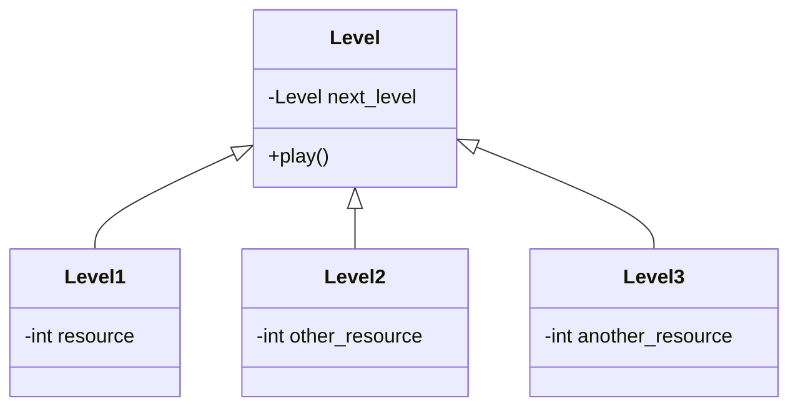

# Project Name

## Team

| ------------------------------------------------ | ------------------------------------------------ | ------------------------------------------------ |
|  |  |  |
| Member 1                                         | Member 2                                         | Member 3                                         \
| Software Development                             | Concept                                          | Design                                           |
{:.team}

## Vision

What was the vision of the project? Where did which inspirations come from? What overall experience should be created and why?

## Concept

What is the more detailed concept for implementing the vision? Which interactions should be possible for which experiences? What is the game loop and where is which experience in it?

## Hardware

What hardware was necessary to realize certain interactions? What else was necessary to use this hardware (e.g. motor drivers, external power supplies, etc.) and what had to be considered for proper function? How did everything have to be connected together? What had to be built (e.g. a case containing the hardware) and how is everything physically installed.

### Example Wiring

This is an example of hardware connection and shows an STM32 Nucleo64 board connected to an MPU-6050 accelerometer.

## Software

Which software components does the gadget consist of? Which component was written in which language and which software was used for it (e.g. IDE, build tools). What additional software was used, e.g. for versioning.

### Example Diagram

This is an example for a class diagram made with [mermaid](https://mermaid-js.github.io/mermaid/#/).

## Repo

Where can the code and other parts (e.g. hardware schematics) of the project be found?
